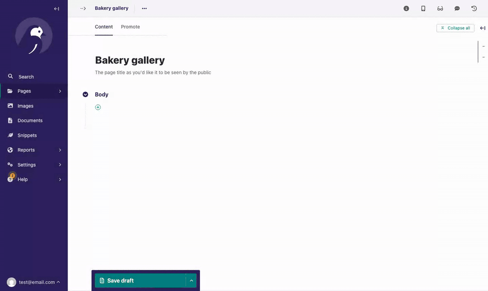

# wagtail-multiple-chooser-block

A StreamField block to choose multiple images, documents, pages or snippets at once, like Wagtail's `MultipleChooserPanel` does for inline models.

`MultipleChooserBlock` is a `ListBlock`. Its "+" buttons open the chooser in multiple selection mode, and every chosen item is added to the list.

In the chooser, selected items stay selected while searching and paginating. They are listed above the confirm button, where they can also be removed from the selection.



## Supported versions

This package supports Wagtail 7.0 and up, with the Python and Django versions [supported by Wagtail](https://docs.wagtail.org/en/stable/releases/upgrading.html#compatible-django-python-versions).

## Installation

```bash
uv add wagtail-multiple-chooser-block
pip install wagtail-multiple-chooser-block
```

Add it to `INSTALLED_APPS`, so its JavaScript is served:

```python
INSTALLED_APPS = [
    # ...
    "wagtail_multiple_chooser_block",
]
```

## Usage

Use it in place of a `ListBlock` of a chooser block:

```python
from wagtail.images.blocks import ImageChooserBlock

from wagtail_multiple_chooser_block.blocks import MultipleChooserBlock


class GalleryBlock(StructBlock):
    images = MultipleChooserBlock(ImageChooserBlock())
```

It works with any chooser block: `ImageChooserBlock`, `DocumentChooserBlock`, `PageChooserBlock`, `SnippetChooserBlock`, and chooser blocks of your own chooser viewsets.

For items with more fields than the chooser, use a `StructBlock` and name the chooser block with `chooser_field_name`, like `MultipleChooserPanel` does:

```python
class CaptionedImageBlock(StructBlock):
    image = ImageChooserBlock()
    caption = CharBlock(required=False)


images = MultipleChooserBlock(CaptionedImageBlock(), chooser_field_name="image")
images = MultipleChooserBlock(ImageBlock(), chooser_field_name="image")
```

The value is stored the same way as a `ListBlock`, so changing a `ListBlock` into a `MultipleChooserBlock` needs a migration, but no data migration.

### Options

Besides the options of `ListBlock`, such as `min_num` and `max_num`:

- `chooser_field_name`: the chooser block within a `StructBlock` child.
- `allow_duplicates`: whether an item can be chosen more than once. Defaults to `True`, like `MultipleChooserPanel`. With `False`, items that are already in the list can't be selected in the chooser.

With `max_num`, the chooser only lets you select as many items as the list has room for, and the "+" buttons are disabled once the list is full.

## Development

```bash
uv sync
uv run playwright install chromium
```

Format and lint:

```bash
uv run ruff format .
uv run ruff check --fix .
```

Run the tests. They edit a page in the Wagtail admin with a real browser, through [Playwright](https://playwright.dev/python/):

```bash
uv run pytest
```

Run the tests against the supported Python, Django and Wagtail versions with tox:

```bash
uv run tox run-parallel
uv run tox run -e py313-django52-wagtail70
```

### Releases

1. Update the version in `pyproject.toml`.
2. Commit, tag and push: `git commit -am "Release v0.1.0" && git tag v0.1.0 && git push --follow-tags`.
3. Create a GitHub release from the tag. CI publishes it to PyPI.

## License

MIT
